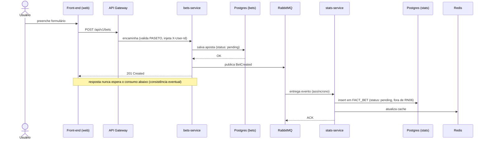
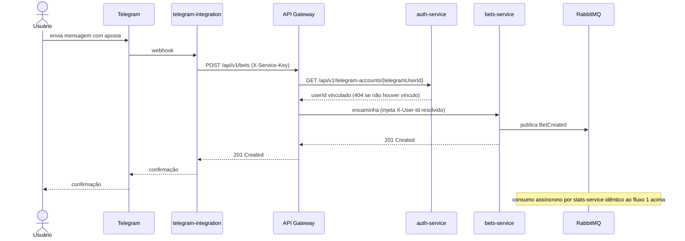
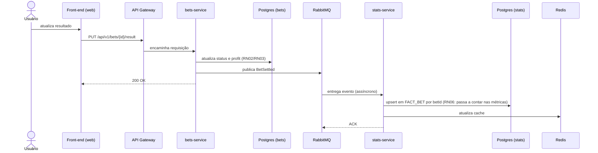
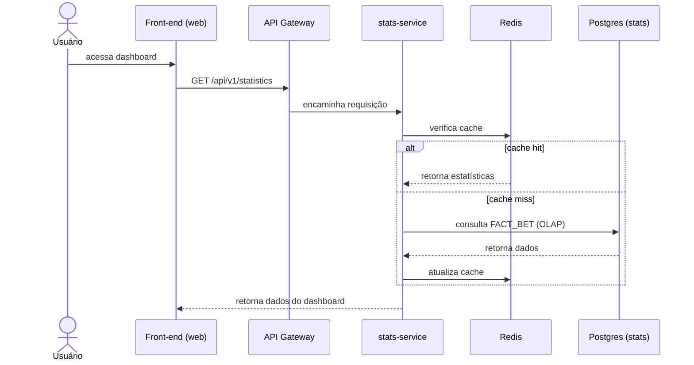

# Arquitetura — Plataforma de Gestão de Bankroll e Análise Estatística de Apostas Esportivas

Fonte: TCC 1 de Eduardo Mateus Immig (UTFPR, 2026) — `TCC_1_Sistema_de_Apostas.pdf` e
`Proposta_TCC_Eduardo_Mateus_Immig.pdf` em `D:\UTFPR\TCC`, e os diagramas originais (ERDs, fluxos
de sequência, casos de uso, implantação), movidos de `D:\UTFPR\TCC\Graficos` para
`docs/diagrams/` (dentro do vault) em 2026-08-02 — ver [[DATA-MODEL]] para os ERDs e a seção
"Fluxos dinâmicos" abaixo para os diagramas de sequência, ambos agora também como Mermaid. Este
vault resume o que foi especificado no TCC 1 para que sessões de agente não precisem reabrir os
PDFs/imagens. Cruzado com todos os diagramas em 2026-08-01 (ver `progress.md` da raiz) — algumas
divergências entre os diagramas e as decisões deste harness foram encontradas e são anotadas
explicitamente onde relevante (ex.: eventos `BetCreated`/`BetSettled`, tabela `PROCESSED_EVENT`,
caminho de confiança de `telegram-integration`). No mesmo dia, decisão adicional do usuário: toda
rota de API/nome e valor de evento é sempre em inglês (os diagramas originais usam português para
esses mesmos conceitos — traduzido aqui, ver [[API-CONTRACTS]]), e o sistema é 100%
internacionalizável na UI/mensagens de erro (ver [[CONVENTIONS]]). Se algo aqui divergir do
código já implementado, o código manda — atualize esta nota.

O TCC 1 entregou apenas especificação, modelagem e prototipação. Codificação e testes são
escopo do TCC 2, ou seja, deste repositório. Ver [[REQUIREMENTS]] para RF/RNF/RN completos.

## Visão geral

Plataforma para consolidar apostas esportivas de múltiplas casas em um único lugar, com
gestão de bankroll (saldo, lucro, prejuízo) e métricas estatísticas (ROI, taxa de acerto,
drawdown). Dois canais de entrada de dados: formulário web manual, e captura remota via bot
do Telegram (o diferencial competitivo do projeto, ver [[REQUIREMENTS]]).

## Harness multinível

Este projeto usa um harness em dois níveis — e **não é um monorepo** (decisão de 2026-08-02, ver
[[DECISIONS-LOG]] "Topologia"):

- **Raiz** (`CLAUDE.md`, `feature_list.json`, `init.sh`, e este vault): invariantes
  cross-service, backlog em nível de epic (uma linha por serviço), e verificação agregada. É um
  repositório Git próprio (`sv-harness`, decisão de 2026-08-19 — ver [[DECISIONS-LOG]]), que
  versiona só docs + harness e ignora `/services/`, `/infra/`, `/apps/`; nenhum código de
  aplicação vive nele.
- **Cada serviço** (`services/<nome>/CLAUDE.md`, `.../feature_list.json`, `.../init.sh`) **e
  também `infra/`** (Docker Compose + teste de resiliência cross-service): convenções
  específicas daquela stack, backlog granular, e verificação daquele serviço — cada um é seu
  próprio repositório Git (7 repositórios de código: 6 serviços + `infra/`; o `sv-harness` da
  raiz é um oitavo, sem código de aplicação).

O Claude Code lê `CLAUDE.md` automaticamente tanto do diretório de trabalho atual quanto dos
diretórios ancestrais — trabalhar dentro de `services/bets-service/` carrega o `CLAUDE.md`
daquele serviço *e* o da raiz. As decisões de arquitetura registradas aqui neste vault (Obsidian,
em `docs/`) são o contrato entre os dois níveis: nenhum `CLAUDE.md` de serviço deve contradizer
o que está aqui sem que este vault seja atualizado primeiro.

## Serviços (arquitetura de microsserviços, fracamente acoplados)

| Serviço | Stack | Responsabilidade | Nota |
|---|---|---|---|
| api-gateway | Java 25 + Spring Boot 4.x + Spring Cloud Gateway | Único ponto de entrada HTTP, valida PASETO, injeta `X-User-Id`/`X-Tenant-Id`, roteia | [[api-gateway]] |
| auth-service | Java 25 + Spring Boot 4.x | Cadastro, autenticação, tokens PASETO | [[auth-service]] |
| bets-service | Java 25 + Spring Boot 4.x | Casas de apostas, apostas, bankroll, movimentações | [[bets-service]] |
| stats-service | Java 25 + Spring Boot 4.x | Consumidor de eventos, OLAP, cache Redis | [[stats-service]] |
| telegram-integration | Python 3.12+ | Parsing de mensagens do bot Telegram | [[telegram-integration]] |
| apps/web | Angular 21.x + TypeScript ES2025 | SPA (dashboards, formulários) | [[web]] |

Cada serviço Java é `stateless` e expõe API REST própria. `auth-service`, `bets-service` e
`stats-service` têm cada um seu próprio banco PostgreSQL (padrão **Database per Service** —
nunca compartilhar schema entre serviços); `api-gateway` não persiste nada (sem banco próprio —
não é uma exceção à regra, apenas não tem estado para guardar). Detalhes de entidades, endpoints
e regras de negócio de cada serviço estão na nota correspondente, não duplicados aqui.

## Infraestrutura

Ver [[infra]] para detalhes de configuração. Resumo:

- **RabbitMQ** (AMQP): broker entre `bets-service` e `stats-service`, com fila de **Dead Letter
  Queue (DLQ)** — mensagens que falham consecutivamente vão para lá em vez de travar o fluxo
  principal ou serem descartadas.
- **PostgreSQL**: uma instância por serviço (Database per Service) — no ambiente local são três
  containers Postgres separados, não três bancos no mesmo servidor (ver [[DECISIONS-LOG]]
  "Postgres por instância"); dentro de
  `auth-service`, `bets-service` e `stats-service`, isolamento adicional por schema por tenant
  (schema-per-tenant, ver [[DECISIONS-LOG]] "Modelo de tenant multiusuário" — decisão de
  2026-08-02 que estendeu esse isolamento também a `auth-service`, não só bets/stats).
- **Redis**: cache distribuído, só usado pelo `stats-service`.
- **Docker**: todos os serviços conteinerizados; `docker-compose.yml` local, Kubernetes é a
  meta de orquestração citada no TCC mas fora do escopo do ambiente de desenvolvimento.
- **API Gateway**: ponto único de entrada HTTP/REST para o front-end web e para
  [[telegram-integration]]; valida token PASETO (ou credencial de serviço) e roteia para o
  serviço correto. É um serviço de aplicação com harness próprio (`epic-008`,
  `services/api-gateway/`), não apenas infraestrutura — ver [[api-gateway]].

### Diagramas estrutural e de implantação (referência do TCC1)

Preservados em `docs/diagrams/architecture/` (movidos de `D:\UTFPR\TCC\Graficos` em 2026-08-02).
Úteis para a visão de containers/deployment que a tabela de serviços acima não cobre (ex.: onde
entra o Load Balancer/Ingress, quais bancos ficam em qual camada) — não repetidos aqui como
Mermaid porque a tabela de serviços já cobre o mesmo conteúdo em texto, e o diagrama de
implantação é o único lugar que modela infraestrutura fora do `docker-compose.yml` (Kubernetes
Ingress), fora do escopo de qualquer nota de serviço.

- `docs/diagrams/architecture/structural-diagram.png` — visão de componentes (frontend, serviços,
  filas, bancos). Nomenclatura menos precisa que o diagrama de implantação (rotula só "Load
  Balancer" onde o outro distingue API Gateway de Load Balancer, ver nota abaixo).
- `docs/diagrams/architecture/deployment-diagram.png` — visão de implantação (Kubernetes).
  Confirma que **API Gateway** (container HTTP/REST, aplicação) e **Load Balancer** (abstração de
  Ingress/Kubernetes, infraestrutura pura) são dois componentes distintos — ver [[api-gateway]]
  para por que isso importa (o Gateway tem lógica de autenticação/roteamento própria, o Load
  Balancer não).

## Fluxos dinâmicos (dos diagramas de sequência do TCC1, movidos para `docs/diagrams/flows/` em 2026-08-02 — implementar fielmente)

Rotas e nomes de evento abaixo já em inglês (ver [[API-CONTRACTS]]) — os diagramas originais do
TCC1 citados usam nomes em português (`/apostas`, `ApostaCriada`) para os mesmos conceitos. Os
quatro diagramas Mermaid abaixo são a transcrição fiel (nomes traduzidos) dos PNGs originais,
mantidos como fonte visual autoritativa a partir de agora pelo mesmo motivo de [[DATA-MODEL]]
(mais fácil de manter em sincronia com o código do que um editor de diagrama externo).

### 1. Registro manual (web)

`POST /api/v1/bets` → API Gateway valida token → `bets-service` persiste a aposta no Postgres
local e responde `201 Created` **antes** de qualquer processamento estatístico → publica
`BetCreated` no RabbitMQ → `stats-service` consome de forma assíncrona, faz *insert* em
`FACT_BET` (ainda `status: pending`, fora das métricas por RN06) e atualiza o cache Redis. A
resposta ao usuário nunca espera o pipeline analítico.

*Diagrama original: `docs/diagrams/flows/manual-bet-registration.png`.*

### 2. Registro via Telegram

Mensagem → [[telegram-integration]] (n8n + Python) faz parsing → chama `POST /api/v1/bets`
através do [[api-gateway]], autenticando com credencial de serviço (`X-Service-Key`) em vez de
token PASETO — o Gateway resolve `telegramUserId -> userId` via [[auth-service]] e injeta
`X-User-Id` antes de rotear para [[bets-service]], o mesmo endpoint usado pelo formulário web →
resto do fluxo é idêntico ao manual (evento `BetCreated`, consumo assíncrono).

**Nota**: o diagrama original (`docs/diagrams/flows/telegram-bet-registration.png`) e o diagrama
estrutural (`docs/diagrams/architecture/structural-diagram.png`) mostram esse serviço chamando
`bets-service` diretamente, sem Gateway e sem nenhum mecanismo de autenticação visível — os
diagramas simplesmente não endereçam essa questão. A passagem pelo `api-gateway` com credencial
de serviço (modelada no Mermaid acima, não no PNG original) é uma decisão deliberada desta
implementação para fechar essa lacuna, não uma divergência por engano.

### 3. Liquidação de aposta

`PUT /api/v1/bets/{id}/result` → API Gateway valida token → `bets-service` atualiza `status` e
calcula `profit` (RN02/RN03), responde `200 OK` → publica `BetSettled` (evento distinto de
`BetCreated`, ver [[API-CONTRACTS]]) → `stats-service` consome de forma assíncrona e faz *upsert*
na linha de `FACT_BET` já existente (por `betId`), passando a contar nas métricas (RN06).

*Diagrama original: `docs/diagrams/flows/bet-settlement.png`.*

### 4. Consulta ao dashboard

`GET /api/v1/statistics` → [[stats-service]] verifica o Redis primeiro (cache hit → responde
direto) → se cache miss, consulta o `FACT_BET` no OLAP, monta o payload, responde, e só depois
grava no Redis para as próximas leituras (cache-aside).

*Diagrama original: `docs/diagrams/flows/dashboard-query.png`. Meta de performance RNF03 (< 300
ms) depende do caminho de cache hit.*

## Decisões que não devem ser reinterpretadas

- Separação OLTP/OLAP é intencional — não migrar cálculos analíticos para o schema transacional
  para "simplificar".
- Consistência **eventual** entre registro e estatísticas é uma decisão de arquitetura, não uma
  falha a corrigir com chamadas síncronas.
- [[telegram-integration]] fica em Python por isolamento de falhas, não por preferência de
  linguagem — não reescrever em Java "para unificar a stack".
- Contratos dos eventos `BetCreated`/`BetSettled` são compartilhados entre [[bets-service]]
  (produtor) e [[stats-service]] (consumidor) — mudar qualquer um dos payloads exige atualizar
  os dois e esta nota no mesmo commit/feature.
- Rotas de API, query params, nomes/valores de evento são sempre em inglês; UI e mensagens de
  erro são sempre localizadas (pt-BR/en-US/es) — ver [[API-CONTRACTS]] e [[CONVENTIONS]]. Não
  misturar as duas coisas (não traduzir uma rota, não deixar um texto de erro hardcoded).
- Tenant é uma **organização com múltiplos usuários independentes**, não sinônimo de um único
  usuário — decisão de 2026-08-02, ver [[DECISIONS-LOG]]. `X-User-Id` (quem) e `X-Tenant-Id`
  (qual organização/schema) são identidades distintas desde então; não voltar a tratá-los como
  o mesmo valor.

## Ver também

- [[DECISIONS-LOG]] — log cronológico de todas as decisões que divergem/estendem o TCC 1
  original (idioma da API, API Gateway, modelo de tenant, etc.), com o racional de cada uma.
  