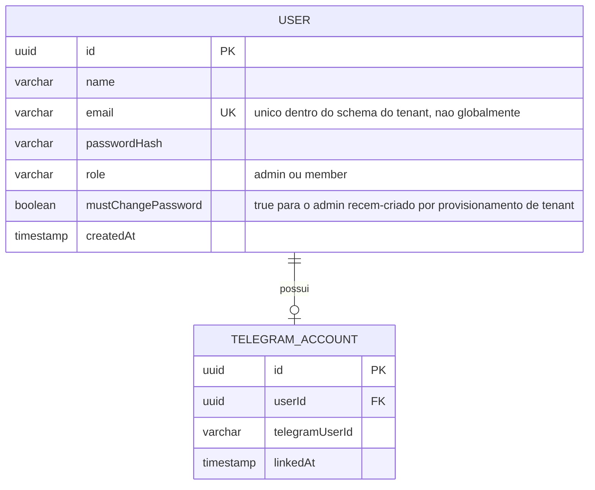
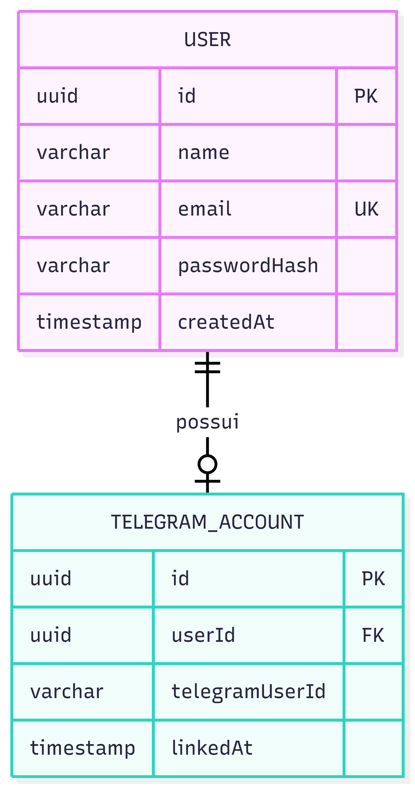
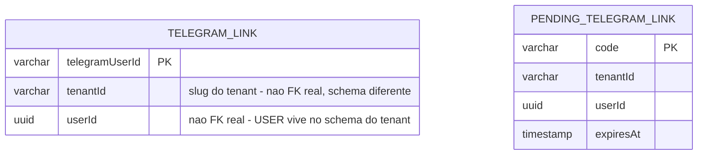
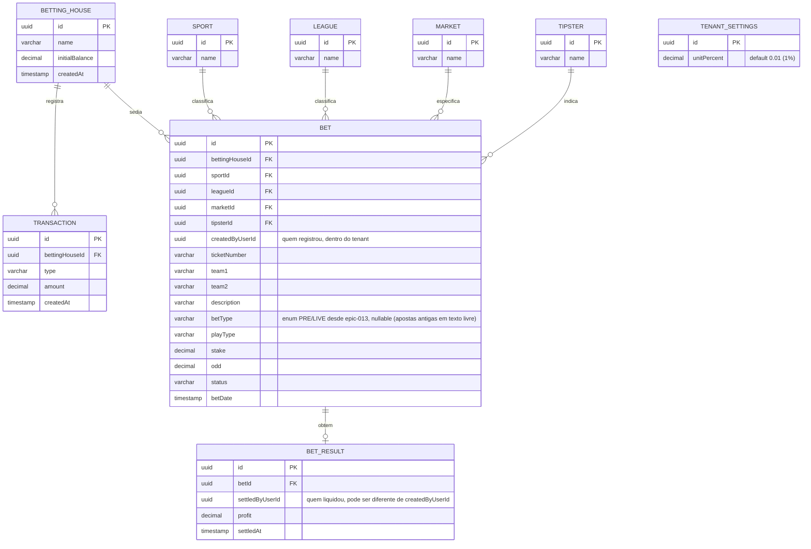
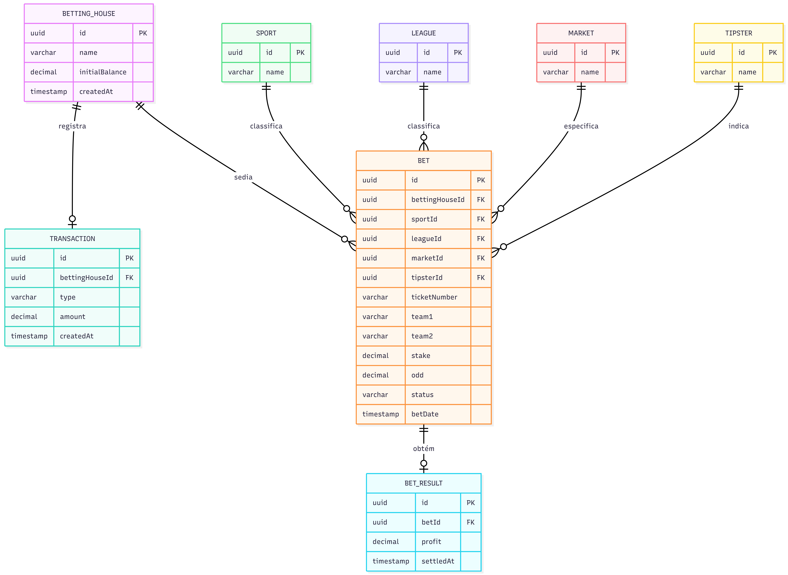
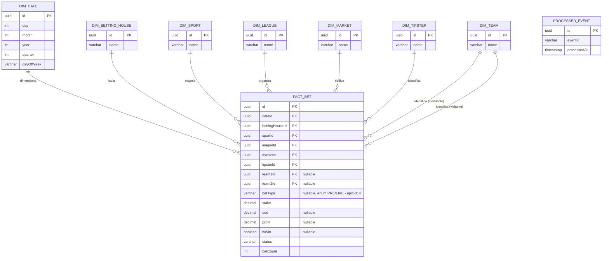
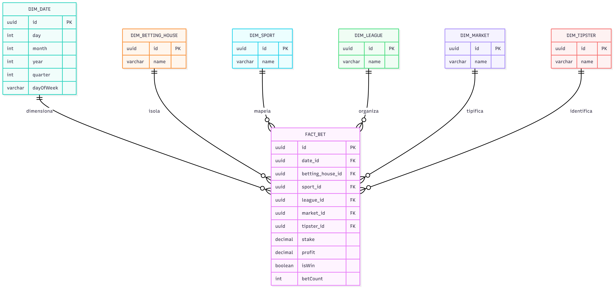

# Modelo de dados — visão consolidada

Nota cross-service que reúne os ERDs de **auth-service**, **bets-service** e **stats-service**
num só lugar, como diagrama Mermaid versionado (revisável em texto/PR, não uma imagem estática).
Cada serviço mantém sua própria lista de colunas/regras em `docs/services/<nome>.md` — esta nota
não duplica aquele texto, só a representação visual e o histórico de evolução do modelo. Ver
[[ARCHITECTURE]] para a justificativa de **Database per Service** e o isolamento por schema
(multi-tenancy) dentro de `bets-service`/`stats-service`.

Os PNGs originais do TCC1 (`D:\UTFPR\TCC\Graficos`, movidos para `docs/diagrams/` em
2026-08-02 — ver `progress.md` da raiz) continuam disponíveis como citação/prova de origem, mas o
Mermaid abaixo é a fonte visual autoritativa a partir de agora: mais fácil de manter em sincronia
com o código do que reabrir um editor de diagrama externo a cada mudança de coluna.

## auth-service (banco `auth`, schema-per-tenant)

Confirmado contra `docs/diagrams/database/auth-service-erd.png` em 2026-08-01. **Divergência
introduzida em 2026-08-02** (ver [[DECISIONS-LOG]] "Modelo de tenant multiusuário"): o ERD
original do TCC1 modelava `USER` como conta individual, sem `role` nem isolamento por schema.
`USER` agora vive dentro do schema do próprio tenant (mesmo padrão schema-per-tenant de
`bets-service`/`stats-service`, estendido também a este serviço) — por isso **não tem coluna
`tenantId`**, o schema já é o limite do tenant, e `email` é único apenas dentro daquele schema,
não globalmente. Ver [[auth-service]] para RF01/RF02 e o fluxo de vínculo de conta Telegram.

`role` (`admin`/`member`) é uma extensão sobre o ERD original do TCC1 — só o `admin` do tenant
pode criar novos usuários (`member`) dentro do mesmo schema. O primeiro `admin` de cada tenant
nasce junto com o schema, via rota administrativa restrita ao operador da plataforma
(`X-Admin-Api-Key`, senha aleatória + `mustChangePassword = true` — ver [[DECISIONS-LOG]] item 3
para o racional completo).

**Nome físico da tabela diverge do nome lógico do ERD** (implementado em `auth-service feat-002`):
`users`/`telegram_accounts` no banco, não `user`/`telegram_account` — `USER` é palavra reservada
no Postgres. Achado do `Plan Reviewer` daquela feature, registrado aqui para quem comparar o ERD
acima com o schema real não confundir com divergência não intencional.

### Diretório global (schema `public`, fora de qualquer tenant)

Duas tabelas adicionadas em 2026-08-02 (ver [[DECISIONS-LOG]] item 15) para resolver
`telegramUserId -> tenant` sem varrer schemas — vivem no schema `public` do banco `auth`, não
dentro de nenhum `tenant_<slug>`, e não são FK real para `USER`/`TELEGRAM_ACCOUNT` (que vivem em
schemas diferentes):

`TELEGRAM_LINK` é o diretório definitivo, consultado por
`GET /api/v1/telegram-accounts/{telegramUserId}`. `PENDING_TELEGRAM_LINK` guarda os códigos de
vínculo de curta duração até a confirmação, que grava em ambos numa única transação local (mesmo
banco Postgres, `public` + schema do tenant — não é uma transação distribuída).

## bets-service (OLTP, schema-per-tenant)

Confirmado contra `docs/diagrams/database/bets-service-erd.png` em 2026-08-01, sem divergências
(revalidado em 2026-08-02). Ver [[bets-service]] para RN01–RN03/RN07 e os eventos publicados.

`status` armazena `pending`/`won`/`lost`/`void` (inglês, ver [[API-CONTRACTS]]). `BET_RESULT` só
existe quando a aposta é liquidada — não é criado junto com `BET` (ver [[bets-service]] seção
"Regras de negócio").

`createdByUserId`/`settledByUserId` são extensão de 2026-08-02 (ver [[DECISIONS-LOG]]) — trilha
de auditoria de **qual usuário** dentro do tenant fez cada ação (`X-User-Id`, distinto do
`X-Tenant-Id` que isola o schema). Não são FK reais (`USER` vive no banco `auth`, outro serviço —
Database per Service não permite FK cross-database) — apenas o `uuid` copiado do header no
momento da chamada, sem integridade referencial garantida pelo Postgres.

> **`betType` vira enum e `TENANT_SETTINGS` é nova em 2026-09-10** (`epic-013` da raiz, pedido do
> usuário, especificação do dashboard consolidado) — sem relação com `bets-service-erd.png`
> original nem com o TCC1. `betType` era `varchar` livre desde o início (sem enum, usuário
> digitava qualquer coisa no registro da aposta); migra para `PRE`/`LIVE` porque o dashboard
> passa a contar apostas por esse campo (ver [[STATISTICS]]) — contagem por string livre
> fragmentaria (`"Live"`/`"live"`/`"Ao vivo"` como valores distintos). Migration não remapeia
> dados antigos (sem forma segura de inferir PRE/LIVE de texto arbitrário) — linhas existentes
> ficam `NULL`. `TENANT_SETTINGS` é linha única por schema de tenant (sem FK — não referencia
> nem é referenciada por nenhuma outra entidade), seed automático (via Flyway, mesmo mecanismo já
> usado pra criar o schema do tenant) com `unitPercent = 0.01` no provisionamento; editável via
> `PATCH /api/v1/settings` (ver [[API-CONTRACTS]]). "Unidade" aqui é percentual configurável da
> banca, decisão do usuário — não um valor fixo em R$ nem um campo por aposta.

## stats-service (OLAP, esquema estrela, schema-per-tenant)

Ver [[stats-service]] para RN04/RN06/RN08/RN09 e as chaves de cache Redis. `status`/`profit`/
`isWin` nullable em `FACT_BET` são uma extensão deliberada sobre o ERD original do TCC1 (RN06
exige excluir apostas `pending` das agregações; sem esses campos não haveria como o *insert*
inicial de `BetCreated` conviver com o *upsert* posterior de `BetSettled` na mesma linha).

`DIM_BETTING_HOUSE`/`DIM_SPORT`/`DIM_LEAGUE`/`DIM_MARKET`/`DIM_TIPSTER.name` são preenchidas a
partir dos campos `bettingHouseName`/`sportName`/`leagueName`/`marketName`/`tipsterName`
denormalizados no payload de `BetCreated`/`BetSettled` (ver [[API-CONTRACTS]] "Contratos de
evento") — `stats-service` nunca consulta `bets-service` de volta para resolver nome (quebraria
consistência eventual). `id` de cada dimensão é o MESMO uuid do catálogo em `bets-service` (`bettingHouseId` etc.), não
um id gerado por `stats-service` — a dimensão é upsert (insere se a linha ainda não existe,
ignora se já existe) por esse id na primeira aposta que a referencia. Os catálogos de
`bets-service` não têm `PUT`/`DELETE` (só `POST`/`GET`, ver [[bets-service]]) — o nome nunca muda
depois de criado, então não há caso de reconciliação a tratar aqui.

> **`DIM_TEAM` e `odd` acrescentados em 2026-09-10** (epic-011 da raiz, tela "Buscar
> Estatísticas") — extensão sobre o ERD original do TCC1, que só previa as 6 dimensões acima.
> `team1`/`team2` já trafegavam no payload de `BetCreated`/`BetSettled` desde o início (ver
> [[bets-service]] `BET.team1`/`team2`, varchar livre — cobre também esportes individuais,
> jogador vai no lugar de time) e `odd` também, mas nenhum dos dois era persistido em
> `FACT_BET` até então (sem requisito que precisasse). `DIM_TEAM`, diferente das outras 5
> dimensões nominais, **não tem catálogo em `bets-service`** (`team1`/`team2` são texto livre
> digitado por aposta, sem tabela `TEAM` própria) — por isso é resolvida por **chave natural
> (nome)**, mesmo padrão já usado por `DIM_DATE` (upsert-if-missing por nome, não por id vindo
> do evento). Como uma aposta referencia até 2 times, `FACT_BET` ganha duas FKs
> (`team1Id`/`team2Id`, ambas nullable — nem toda aposta tem confronto de dois lados,
> ex. handicap de jogador) em vez de uma dimensão-ponte; filtrar "por time" nas estatísticas é
> `team1Id = X OR team2Id = X`. Ver [[stats-service]] para o endpoint que consome isso.

> **`betType` acrescentado em 2026-09-10** (`epic-014` da raiz, extensão do dashboard
> consolidado) — mesmo padrão de `team1Id`/`team2Id`/`odd`: só existe em `BetCreated`, nunca em
> `BetSettled` (ver [[bets-service]]), então é gravado **só no insert inicial** e nunca
> sobrescrito pelo *upsert* de liquidação. Fonte é o `BET.betType` de `bets-service`, que migrou
> de texto livre para enum `PRE`/`LIVE` na mesma rodada (`epic-013`, ver seção "bets-service"
> acima) — sem essa migração, agrupar por `betType` aqui seria agrupar por string arbitrária.
> Apostas com `betType` nulo (anteriores à migração) não entram em nenhuma contagem PRÉ/LIVE do
> dashboard (ver [[STATISTICS]]).

`PROCESSED_EVENT` não participa do esquema estrela (não é fato nem dimensão) — controle técnico
de idempotência de consumo de evento, sem relacionamento de FK com `FACT_BET`. Ver seção
"Evolução do modelo" abaixo para por que essa tabela precisou ser revivida de um diagrama mais
antigo.

### Nomenclatura de FK divergente entre revisões do ERD original

A revisão de 21/06 do diagrama OLAP (`stats-service-olap-erd.png`, acima) nomeia as colunas de FK
de `FACT_BET` em `snake_case` (`date_id`, `betting_house_id`, ...), enquanto a revisão de 27/05
(`stats-service-olap-erd-v1-superseded.png`) usa `camelCase` (`dateId`, `bettingHouseId`, ...) —
inconsistência entre os dois próprios diagramas do TCC1, não uma mudança de decisão intencional.
Esta implementação segue **camelCase** (fiel a `docs/services/stats-service.md`, já escrito antes
desta nota, e consistente com o restante do código Java) — se uma sessão futura notar `snake_case`
no diagrama mais recente, isso já foi visto e propositalmente não seguido.

## Evolução do modelo (histórico — não normativo, só contexto)

Os diagramas abaixo são versões anteriores/descartadas, preservadas em `docs/diagrams/database/`
com sufixo `-superseded` só para rastreabilidade — nenhuma delas deve ser usada como referência
para implementar algo hoje, o Mermaid acima já é a versão corrigida/atual:

- **`conceptual-er-draft-superseded.png`** (20/05, anterior ao split em microsserviços): rascunho
  inicial monolítico — `USER` e `BET` no mesmo diagrama com FK direta entre eles (antes da decisão
  de Database per Service), um único `BET_EVENT` genérico (antes do split em `BetCreated`/
  `BetSettled`), `STATS_SNAPSHOT` como tabela plana denormalizada (antes de virar o esquema
  estrela `FACT_BET` + dimensões). É a **origem** da tabela `PROCESSED_EVENT`, que não sobreviveu
  aos diagramas OLAP mais recentes mas foi revivida deliberadamente em `stats-service` porque o
  requisito de idempotência (ver [[TESTING]]) não tem outro mecanismo definido — decisão registrada
  em `progress.md` da raiz, entrada "Cruzamento com os diagramas originais do TCC1 (2026-08-01)".
- **`combined-overview-pre-split-superseded.png`** (27/05): visão combinada de todos os serviços
  num diagrama só (`USER`/`TELEGRAM_ACCOUNT`/`BETTING_HOUSE`/`TRANSACTION`/catálogos/`BET`/
  `BET_RESULT`) — útil para entender o modelo lógico completo de uma vez, mas fisicamente
  desatualizada: já não representa o isolamento por banco (Database per Service) que separa
  `auth`/`bets`/`stats` em instâncias Postgres distintas.
- **`stats-service-olap-erd-v1-superseded.png`** (27/05): primeira versão do esquema estrela,
  substituída pela revisão de 21/06 (`stats-service-olap-erd.png`, a citada acima) — a diferença
  relevante é só a nomenclatura de FK discutida na seção anterior, o formato geral (fato +
  dimensões) já estava certo desde essa primeira versão.

## Ver também

- [[ARCHITECTURE]] — Database per Service, separação OLTP/OLAP, multi-tenancy por schema.
- [[auth-service]], [[bets-service]], [[stats-service]] — colunas, regras de negócio (RN01–RN09)
  e endpoints de cada serviço; esta nota só cobre a estrutura de tabelas, não comportamento.
- [[API-CONTRACTS]] — contratos `BetCreated`/`BetSettled`, o payload que conecta o OLTP de
  `bets-service` ao OLAP de `stats-service`.
- [[DECISIONS-LOG]] — racional completo do modelo de tenant multiusuário (por que `USER` não tem
  `tenantId`, por que o login exige slug de organização, diretório global que resolve o lookup
  de Telegram). Poucos pontos de UI ainda em aberto — ver [[web]].
