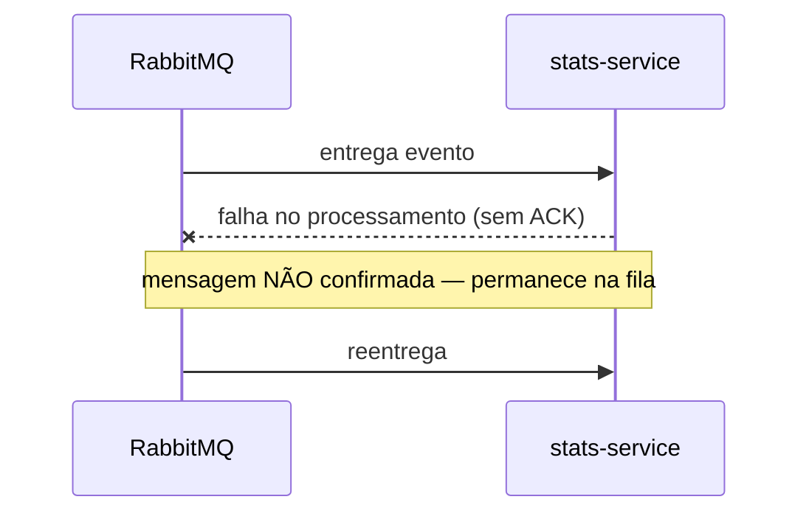
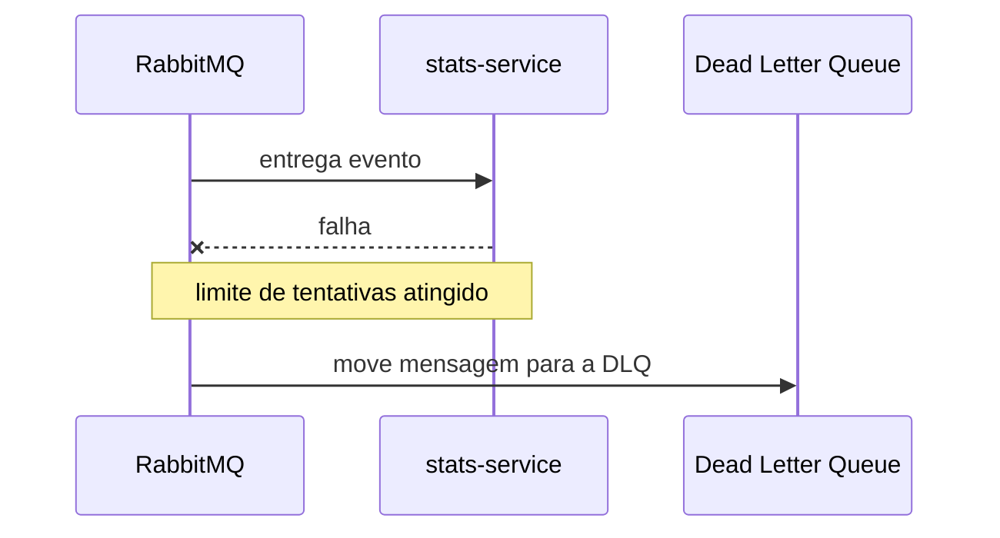
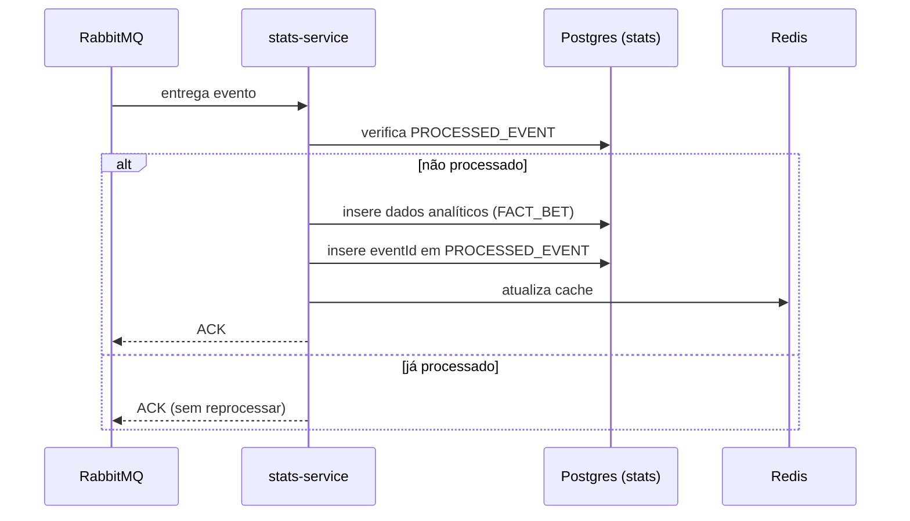
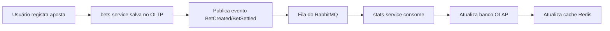
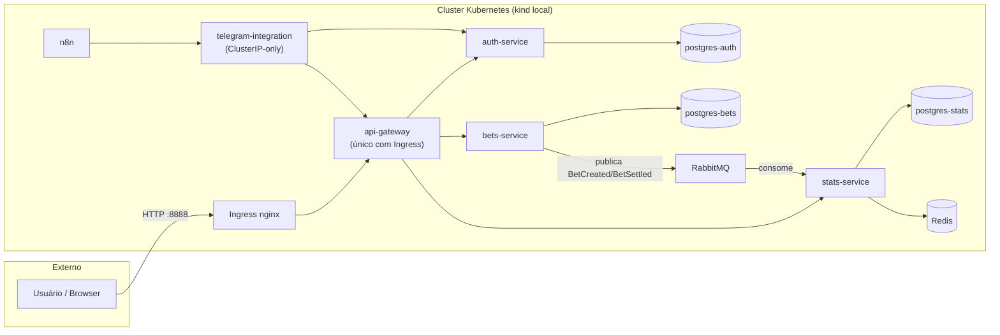

# infra

Docker Compose local para os serviços de infraestrutura compartilhada, mais o teste de
resiliência cross-service (`epic-007`). Ver [[ARCHITECTURE]] para o panorama geral. Não tem
serviço de aplicação (não é Java/Python/Angular), mas **tem harness de código completo e
repositório Git próprio** (`infra/`, 7º repositório do projeto — decisão de 2026-08-02, ver
[[DECISIONS-LOG]] "Topologia") — cobre dois epics da raiz, `epic-001` (`feat-001` em
`infra/feature_list.json`) e `epic-007` (`feat-002`), já que nenhum dos dois pertence a um
serviço de aplicação e a raiz não pode hospedar código versionado.

## Componentes

- **PostgreSQL**: **uma instância (container) por serviço de aplicação** — `postgres-auth`,
  `postgres-bets` e `postgres-stats`, portas `5432`/`5433`/`5434` (Database per Service, ver
  [[DECISIONS-LOG]] "Postgres por instância") — ver [[auth-service]], [[bets-service]] e
  [[stats-service]] para os schemas de cada um. Dentro de cada instância, isolamento adicional
  por schema por tenant.
- **RabbitMQ** (AMQP): broker entre [[bets-service]] (produtor de `BetCreated` e
  `BetSettled`) e [[stats-service]] (consumidor). Precisa de uma **Dead Letter Queue (DLQ)**
  configurada desde o início — mensagens que falham consecutivamente vão para lá em vez de
  travar o fluxo principal ou serem descartadas silenciosamente. Comportamento exato esperado
  (fiel aos diagramas originais do TCC1, movidos para `docs/diagrams/flows/` em 2026-08-02) na
  seção "Resiliência" abaixo — relevante para `epic-007` (raiz).
- **Redis**: cache distribuído, usado exclusivamente por [[stats-service]] (padrão
  Cache-Aside).
- **n8n**: recebe o webhook do bot do Telegram e aciona [[telegram-integration]].

## Resiliência: DLQ e retry automático (relevante para `epic-007`)

Transcrição fiel (Mermaid) dos diagramas de fluxo do TCC1 sobre o comportamento de RabbitMQ em
falha — os PNGs originais ficam em `docs/diagrams/flows/` como prova de origem, o Mermaid abaixo
é a versão autoritativa a partir de agora (mesmo motivo de [[DATA-MODEL]] e da seção "Fluxos
dinâmicos" de [[ARCHITECTURE]]).

### Consumo com retry automático

Redelivery do RabbitMQ quando o consumidor falha ao processar (nack/exceção) sem confirmar o
ACK — a mensagem não se perde, volta para a fila e é reentregue.

*Diagrama original: `docs/diagrams/flows/automatic-retry.png`.*

### Dead Letter Queue (DLQ)

Se as tentativas de reentrega consecutivas continuarem falhando (limite de tentativas do
RabbitMQ, configurado no `docker-compose.yml`/definição da fila), a mensagem é movida para a DLQ
em vez de ficar em loop infinito ou ser descartada — fica disponível para inspeção/reprocessamento
manual sem travar o consumo das mensagens seguintes.

*Diagrama original: `docs/diagrams/flows/dead-letter-queue.png`.*

O limite de tentativas é `x-delivery-limit: 3` na fila `stats.bet-events` (quorum queue — ver
tabela de topologia em [[API-CONTRACTS]]), mas **desde 2026-09-09 esse número só é decorativo no
broker — quem efetivamente conta e aciona a DLQ é o retry de aplicação em `stats-service`**, não
mais o RabbitMQ. Ambiente local usa a estratégia de dead-lettering **default do RabbitMQ,
`at-most-once`**: em falha de broker a mensagem pode se perder no trajeto até a DLQ.
`at-least-once` exigiria `overflow: reject-publish` (que passa a rejeitar publicação quando a
fila enche, mudando o comportamento visível de `bets-service`) — tradeoff aceito conscientemente
para o ambiente de desenvolvimento, ver [[DECISIONS-LOG]].

> **Achado real de `infra/feat-002` (2026-09-09), confirmado ao vivo contra o broker**: a partir
> do RabbitMQ 4.3 (a versão real deste projeto é `rabbitmq:4-management-alpine` → 4.3.5),
> `nack(requeue=true)` — o que o `ConditionalRejectingErrorHandler` padrão do Spring AMQP faz em
> qualquer exceção não-fatal do listener — virou um "explicit return" e **deixou de contar** para
> `x-delivery-limit`; só `reject` (`requeue=false`) ou redelivery real por queda de
> conexão/canal conta. Reproduzido ao vivo: derrubar `postgres-stats` e publicar 1 evento fez o
> consumidor falhar **15 vezes seguidas** sem a mensagem nunca sair de `stats.bet-events` — o
> `x-delivery-count` da mensagem ficava travado em `1` (`x-acquired-count` subindo a cada
> tentativa). Sem correção, isso quebraria o próprio objetivo deste epic: uma mensagem
> "envenenada" travaria o único consumidor para sempre, em vez de isolar via DLQ.
> **Fix aplicado em `stats-service/feat-010`**: `spring.rabbitmq.listener.simple.retry`
> (`enabled: true`, `max-attempts: 3`, `initial-interval: 1000`, ver `application.yml`) — após
> esgotar as tentativas **em processo** (sem tocar o broker entre elas), o
> `RejectAndDontRequeueRecoverer` padrão do Spring Boot rejeita a mensagem com `requeue=false`,
> o que sempre morta-letra via DLX **independente da contagem do broker**. `x-delivery-limit: 3`
> continua configurado na fila como defesa em profundidade (protege contra o caso de queda real
> de conexão/canal, que ainda incrementa `x-delivery-count`), mas deixou de ser o mecanismo
> primário. Qualquer outro serviço Java que vier a consumir fila própria (nenhum hoje além de
> `stats-service`) precisa do mesmo `spring.rabbitmq.listener.simple.retry` para ter DLQ
> funcional em RabbitMQ 4.3+.

> **Tempo real observado (`infra/feat-002.4`, rodada final após o fix acima)**: com o fix já
> aplicado, derrubar `postgres-stats` e publicar 1 evento levou **~105s** até a mensagem cair em
> `stats.bet-events.dlq` (`x-death` com `reason: rejected`) — bem mais que os 3×1s que
> `initial-interval: 1000` sozinho sugeriria. Causa: cada uma das 3 tentativas de aplicação
> primeiro tenta adquirir uma conexão do pool do HikariCP, que só desiste após o
> `connection-timeout` default (30s) — 3 × ~30s domina o tempo total, o `initial-interval` entre
> tentativas é irrelevante perto disso. O registro síncrono da aposta via `api-gateway` devolveu
> `201` imediatamente mesmo com `postgres-stats` fora do ar (não houve poll contínuo de health
> durante os ~105s de retry, mas `auth-service`/`bets-service`/`api-gateway` foram reconferidos
> saudáveis logo após a mensagem cair na DLQ) — isolamento de falha confirmado ao vivo, não só
> por leitura de código.

### Consumo idempotente (verificação de `PROCESSED_EVENT`)

Complementar ao retry acima: mesmo quando a entrega é duplicada (redelivery após um ACK que se
perdeu na rede, por exemplo), o processamento em si não duplica métricas — ver [[stats-service]]
seção "Idempotência" para a tabela `PROCESSED_EVENT`.

*Diagrama original: `docs/diagrams/flows/event-consumption.png`.*

### Visão completa (consistência eventual ponta a ponta)

*Diagrama original: `docs/diagrams/flows/eventual-consistency-overview.png`. Teste de aceite de
`epic-007`: derrubar `stats-service`, publicar eventos via `bets-service`, subir `stats-service`
de novo, confirmar reprocessamento (mensagens acumuladas na fila, não perdidas).*

## Kubernetes (`epic-010`, `infra/feat-004`, 2026-09-10)

Alvo real de implantação especificado no TCC 1 (Figura 5, "Diagrama de Implantação da
Infraestrutura baseada em Microsserviços") — `docker-compose.yml` continua sendo o ambiente de
desenvolvimento local, não é substituído. Manifests YAML puros (decisão do usuário — sem Helm,
~10 componentes fixos de um único ambiente não justificam templating) em `infra/k8s/`.

Decisões de desenho, todas com precedente ou motivo documentado:

- **Imagens**: `Dockerfile` de cada um dos 5 serviços de aplicação (4 Java + Python) foi feito
  como feature própria em cada repositório de serviço (mesmo precedente de "porta HTTP fixa"),
  não neste harness — ver `auth-service feat-011`, `bets-service feat-013`,
  `stats-service feat-011`, `api-gateway feat-009`, `telegram-integration feat-007`. Imagens
  locais (`stakevault/<serviço>:local`), carregadas no cluster via `kind load docker-image` —
  `imagePullPolicy: Never`, sem registry configurado (fora de escopo de um cluster de
  demonstração local de TCC).
- **`telegram-integration` entrou no escopo** desta migração (decisão do usuário) mesmo nunca
  tendo passado por `docker-compose.yml` antes — só `n8n` estava provisionado ali. Fica
  `ClusterIP`-only, sem `Ingress`: o residual de auth/rate-limit em `POST /bets/capture`/
  `/telegram/link` (aceito em `services/telegram-integration/n8n/README.md` enquanto o serviço
  não era exposto) continua válido, a internet nunca alcança esse pod diretamente.
- **Segredos**: um único `Secret` (`stakevault-secrets`) referenciado por todos os Deployments,
  não um por serviço — chaves compartilhadas entre serviços (`ADMIN_API_KEY`/
  `PASETO_LOCAL_KEY`/`SERVICE_KEY`) ficariam fáceis de divergir em Secrets separados.
  `k8s/secret.example.yaml` versionado com placeholders, `k8s/secret.yaml` (valores reais)
  nunca versionado — mesmo padrão do `.env`.
- **Topologia do RabbitMQ não é duplicada em YAML**: o `ConfigMap` `rabbitmq-definitions` é
  gerado a partir dos mesmos `rabbitmq/definitions.json`/`apply-definitions.sh` que o
  `docker-compose.yml` já usa (`kubectl create configmap ... --from-file=... --dry-run=client -o
  yaml | kubectl apply -f -`), evitando uma segunda cópia que divergiria se um mudasse sem o
  outro.
- **Sem `depends_on`/`condition: service_healthy`** (mecanismo do compose, não existe no
  Kubernetes): o `Job` `rabbitmq-init` usa um `initContainer` (`busybox`, `nc -z rabbitmq 5672`
  em loop) esperando a porta AMQP responder antes de rodar o mesmo script de sempre.
- **Rotas administrativas continuam fora do Gateway** (mesmo desenho de sempre, ver
  [[API-CONTRACTS]]): só `api-gateway` tem `Ingress`; `auth-service`/`bets-service`/
  `stats-service` são `Service` `ClusterIP`-only — o operador roda `POST
  /api/v1/admin/tenants` via `kubectl port-forward svc/<nome> <porta>:<porta>`, não um
  workaround temporário, é assim que se opera um cluster real também.

**Verificado de ponta a ponta contra um cluster `kind` local** (não só `kubectl get pods`
verde): tenant provisionado via `port-forward`, login e registro de aposta via `Ingress`
(`http://localhost:8888`, porta mapeada em `k8s/kind-config.yaml`), `FACT_BET`/
`PROCESSED_EVENT` conferidos dentro do pod `postgres-stats` — o mesmo fluxo do
`docker-compose`, agora rodando no cluster. Passo a passo completo em `infra/CLAUDE.md` seção
"Verificação — Kubernetes".

### Migração pro k3s de produção (`infra/feat-005`, 2026-09-11)

Mesmos manifests, agora contra o servidor Debian real (k3s, não `kind`) puxando as 6 imagens do
GHCR (`imagePullSecrets: ghcr-pull`) em vez de `kind load` — ver `docs/CI-CD.md` seção "Build e
push de imagem Docker pro GHCR". `web` (frontend) ganhou manifest próprio pela primeira vez
(nunca tinha, mesmo depois de `feat-004`); `ingress.yaml` foi dividido por path pra acomodar os
dois (`/api` pro `api-gateway`, `/` pro `web` — rotas de negócio já nascem com o prefixo
`/api/v1/...`, sem precisar de rewrite).

**Achado real, só apareceu no servidor real (nunca no `kind`)**: `readinessProbe`/
`livenessProbe` do RabbitMQ (`exec: rabbitmq-diagnostics check_running`) sem `timeoutSeconds`
explícito usam o default do Kubernetes (**1 segundo**) — curto demais pro
`rabbitmq-diagnostics`, que tem overhead real de boot do Erlang/JVM e rotineiramente passa de 1s
sob qualquer carga. Sintoma: RabbitMQ reiniciado dezenas de vezes em poucas horas (kubelet mata o
container a cada timeout de probe), o que também deixava o `Job` `rabbitmq-init` preso pra
sempre no `initContainer` (nunca havia uma janela estável de RabbitMQ de pé por tempo
suficiente). Corrigido com `timeoutSeconds: 10` nos dois probes. Qualquer probe `exec` contra uma
CLI de diagnóstico (não um `httpGet` simples) deveria vir com `timeoutSeconds` explícito desde o
início, não confiar no default de 1s.

**Segundo achado, mesmo evento**: o `ConfigMap` `rabbitmq-definitions` (gerado manualmente via
`kubectl create configmap --from-file=...`, nunca um arquivo YAML versionado - ver
`infra/CLAUDE.md`) precisa ser recriado em **todo cluster novo**, não só documentado uma vez para
o `kind` original - faltou nesse primeiro `apply` no k3s (cluster novo, nunca tinha rodado o
comando), e o sintoma (`MountVolume.SetUp failed ... configmap "rabbitmq-definitions" not
found`) só aparece no `kubectl describe pod` do Job, não no `kubectl get pods` nem nos logs do
RabbitMQ em si.

## Onde fica

`infra/docker-compose.yml` (criado em `feat-001`, 2026-08-03), mais:

- `infra/.env.example` — todas as variáveis, sem valor real. Nenhuma variável tem default no
  compose: sem `.env` o `up` falha em vez de subir com credencial conhecida.
- `infra/rabbitmq/definitions.json` — exchanges, filas e bindings (tabela em [[API-CONTRACTS]]).
- `infra/rabbitmq/apply-definitions.sh` — aplicado por um container one-shot `rabbitmq-init`
  depois do broker ficar `healthy`. A topologia **não** é carregada por `load_definitions`
  porque a documentação oficial do RabbitMQ é explícita: *"if a blank (uninitialised) node
  imports a definition file, it will not create the default virtual host and user"* — o broker
  subiria sem vhost e sem usuário, com o healthcheck ainda passando (o nó está rodando). Ver
  [[DECISIONS-LOG]] "Topologia RabbitMQ aplicada pós-boot".

Serviços e portas: `postgres-auth` 5432, `postgres-bets` 5433, `postgres-stats` 5434,
`rabbitmq` 5672 + 15672 (console), `redis` 6379, `n8n` 5678. `n8n` não depende de nenhum outro
container — o fluxo é webhook → n8n → rotina Python → `POST /api/v1/bets` no [[api-gateway]]
(ver [[telegram-integration]]); n8n nunca fala com o broker.

Harness de código em `infra/CLAUDE.md` — comandos, regras específicas e definição de pronto
deste repositório.

## Ver também

- [[ARCHITECTURE]] — decisão de manter RabbitMQ com DLQ desde o início, não como melhoria futura.
- [[api-gateway]] — **não** faz parte deste harness, apesar de aparecer em diagramas de
  infraestrutura em outros projetos. É um serviço de aplicação com harness e repositório
  próprios (`epic-008`, `services/api-gateway/`), porque valida token e tem lógica de
  roteamento/negócio (credencial de serviço), não é só um componente de infraestrutura genérico —
  ver [[DECISIONS-LOG]] "Topologia" para o racional de por que `infra/` virou repositório próprio
  em vez de viver dentro de `api-gateway`.
- [[DECISIONS-LOG]] — decisão de 2026-08-02 que deu a `infra/` harness e repositório próprios.
